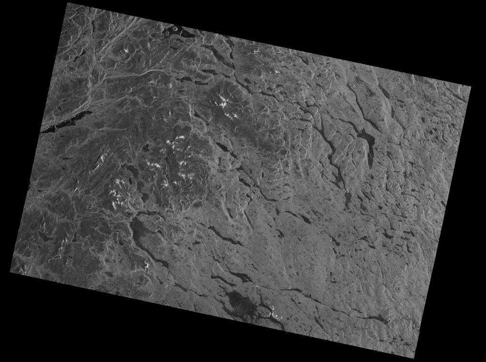
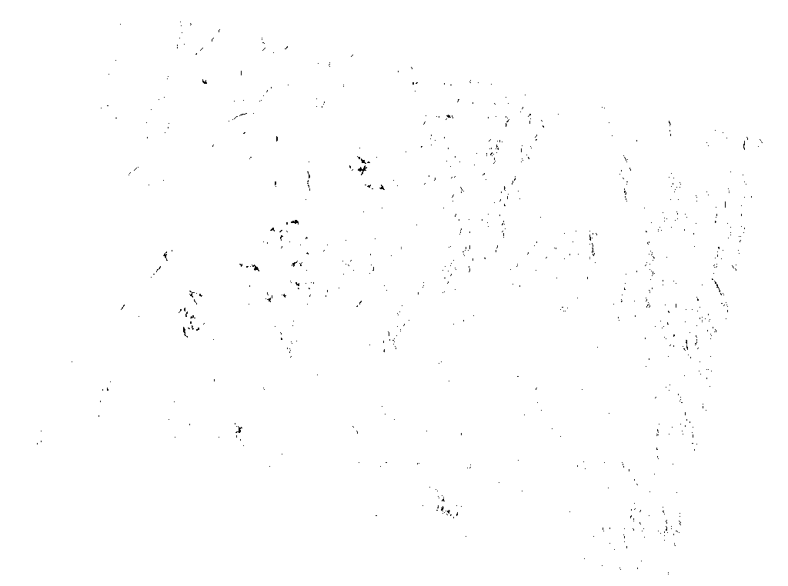
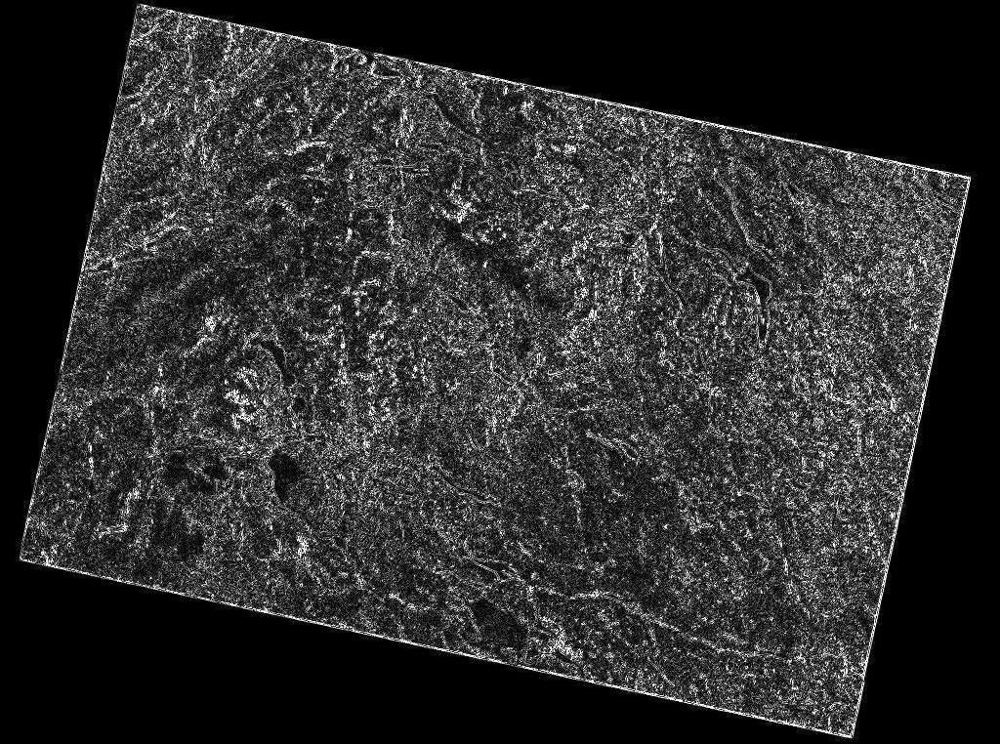
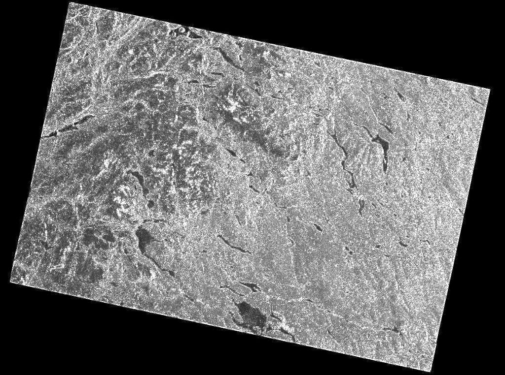

# Taller: Procesamiento Gaussiano y Filtrado Espacial en Imagen Satelital

**Integrantes:**
*   Juan Hurtado
*   Miguel Flechas
*   Andrés Castro

---

## 1. Representación Digital e Histograma

**Preguntas**
*   **¿La imagen tiene alto contraste?** No, la imagen original no tiene un contraste muy alto. A simple vista plana, muchos detalles finos se pierden sin aplicar un estiramiento de histograma o realce.
*   **¿Está concentrada en tonos oscuros?** Sí. Al tratarse de una imagen de radar sin estiramiento de contraste agresivo y convertida a escala de grises [0, 255], se observa una media en el valor ~59, lo cual confirma que los valores están sesgados hacia el lado oscuro del histograma.
*   **¿Qué podría representar eso (agua, vegetación, ciudad)?** Dado que es una imagen de radar SAR (Sentinel-1), las superficies lisas como el **agua** actúan como espejos especulares, reflejando el pulso lejos del satélite y apareciendo muy oscuras. Las zonas de brillo intermedio suelen representar **vegetación** o suelo desnudo, mientras que el **entorno urbano o montañas** devuelve señales muy fuertes debido al efecto *corner reflector*, mostrándose como puntos muy blancos, aunque en proporción suelen ser minoría comparados con la vastedad del agua o vegetación.

---

## 2. Segmentación Gaussiana

**Análisis de la segmentación ($\mu \pm 2\sigma$)**
La media calculada fue de `59.12` y la desviación estándar de `47.65`. Por ende, el rango dinámico seleccionado fue aproximadamente de `[0, 154]`.

**Preguntas**
*   **¿Qué regiones quedan como fondo?** Con este rango paramétrico, las regiones oscuras (como agua y vegetación de baja densidad) quedan segmentadas como 255 (píxeles blancos en la máscara final), clasificándolos como "fondo".
*   **¿Qué pasa si usamos 1$\sigma$?** Si cerramos el rango a $\mu \pm 1\sigma$ (aprox. `[11, 107]`), la segmentación sería mucho más restrictiva. Muchos más píxeles (tanto oscuros extremos como claros medios) serían descartados, volviendo la máscara blanca mucho más reducida y fragmentada.
*   **¿Y si usamos 3$\sigma$?** Al ampliar a $\mu \pm 3\sigma$ (aprox. `[0, 202]`), casi toda la imagen caería dentro de la máscara (fondo), a excepción de los píxeles extremadamente brillantes correspondientes a ciudades o picos montañosos.

---

## 3. Filtros de Suavizado (Lowpass) - Gaussiano

**Resultados de Desviación Estándar:**
*   **Desviación original:** `47.65`
*   **Desviación suavizada:** `46.06`

**Preguntas**
*   **¿Disminuyó la varianza?** Sí, la varianza disminuyó en un 6.56%.
*   **¿Qué significa físicamente?** Físicamente significa que los píxeles extremos (los más brillantes o los más oscuros) han sido promediados con sus vecinos. El contraste local ha disminuido, y la transición entre zonas de diferentes intensidades ahora es gradual.
*   **¿Se redujo ruido speckle (si es radar)?** Sí, el suavizado gaussiano difumina el ruido granular de alta frecuencia aleatorio propio del radar de apertura sintética (speckle). Esto "limpia" superficies continuas como las del agua, pero a la vez, reduce la nitidez de los bordes reales.

---

## 4. Filtros de Afilado (Highpass) - Laplaciano

*(Imagen generada por el Laplaciano puro)*

*(Imagen Original + Laplaciano)*

**Discusión**
*   **¿Se resaltan bordes?** Completamente. Al sumar la original con las altas frecuencias detectadas por el Laplaciano, todas las transiciones abruptas (carreteras, montañas, costas, ciudades) brillan y se delimitan claramente en la Imagen Afilada.
*   **¿Se amplifica ruido?** Desafortunadamente, sí. Al igual que el Laplaciano resalta bordes útiles, también marca fuertemente cada grano de ruido speckle como un "mini borde", volviendo la imagen final en general más ruidosa y granulada que la original.
*   **¿Conviene suavizar antes de afilar?** Sí, por el punto anterior. Si difuminamos el ruido speckle (Lowpass Gaussiano) primero, dejamos únicamente presentes los macro bordes verdaderos de la geografía, de modo que cuando aplicamos el Laplaciano (Highpass), este sólo afila estructuras reales y no aumenta el ruido local parasitario.

---

## 5. Comparación Final Integrada (Pipeline Completo)

*(Resultado de aplicar el suavizado Gaussiano, luego extraer bordes con Laplaciano, y finalmente sumar para realzar)*.
Este es el resultado óptimo: el ruido granular ha sido mitigado mediante el paso Gaussiano inicial, permitiendo que el posterior afilado por Laplaciano exalte contornos mucho más limpios correspondientes a verdaderas divisiones de la escena, sin sobre-amplificar el ruido speckle.

---

## 6. Construcción y Análisis del Kernel Gaussiano 2D

El programa construyó Kernels Gaussianos utilizando la ecuación matemática para una matriz manual de 5x5 evaluada para diferentes valores de $\sigma$.

**Para $\sigma = 1.0$:**
*   Suma de la matriz: `1.0`
*   Valor Central: `0.162`
*   Valores periféricos: `0.0029` (extremos).

**Análisis de las Preguntas:**
1.  **¿La suma de los elementos es aproximadamente 1?**
    Sí, en nuestro algoritmo hemos normalizado obligatoriamente dividiendo la matriz sobre la suma de sus valores. Esto es crucial porque para aplicar una convolución sin oscurecer o iluminar toda la imagen globalmente, el núcleo matemático (kernel) debe sumar 1 absoluto.
2.  **¿El centro tiene el valor mayor?**
    Sí, en $\sigma = 1.0$, el centro (`0.162103`) tiene dominancia máxima, y a medida que se radializa, decae exponencialmente de acuerdo a la campana gaussiana bidimensional.
3.  **¿Qué ocurre si $\sigma = 0.5$?**
    La campana se vuelve muchísimo más estrecha. El centro toma un valor dominante gigante (`0.618`), y los bordes caen drásticamente casi a niveles microscópicos (`6.9e-08`). El efecto de difuminado sobre la imagen será **mínimo**, comportándose casi puramente como la matriz identidad original.
4.  **¿Qué ocurre si $\sigma = 3$?**
    La campana se "aplasta" ensanchándose. Los valores dentro de un kernel 5x5 cambian muy poco entre ellos: el centro vale `0.049` y los bordes `0.031`. El efecto de filtrado será de un difuminado **muy alto e indiscriminado**, pareciéndose cada vez más a un simple filtro de promediado de cajas.
